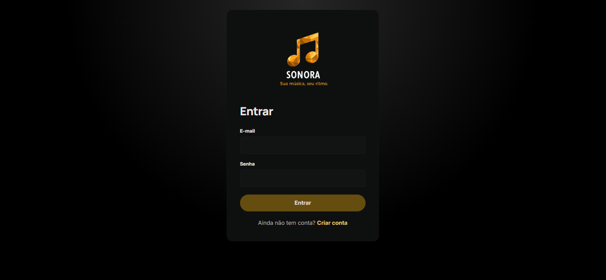
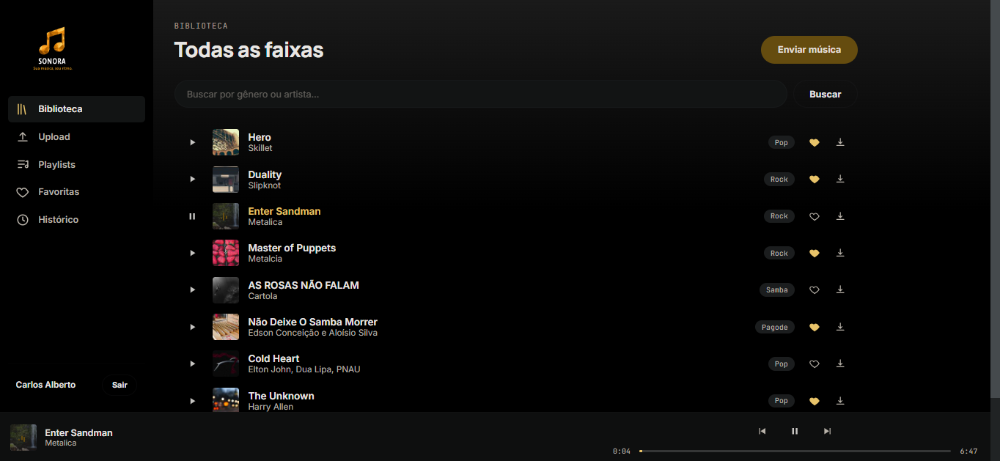
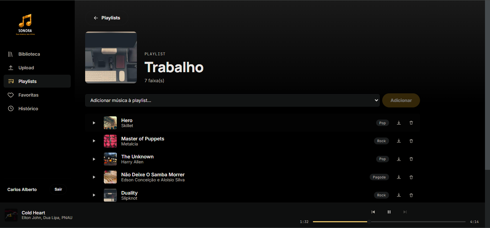
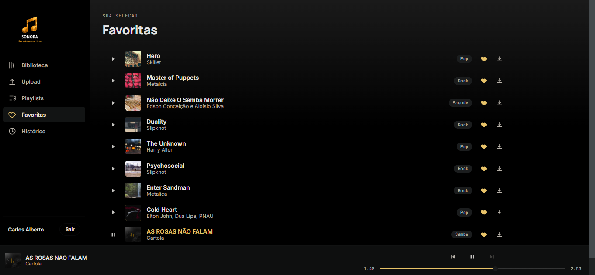
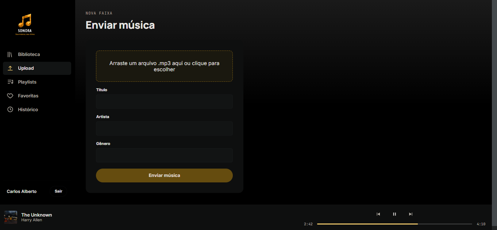
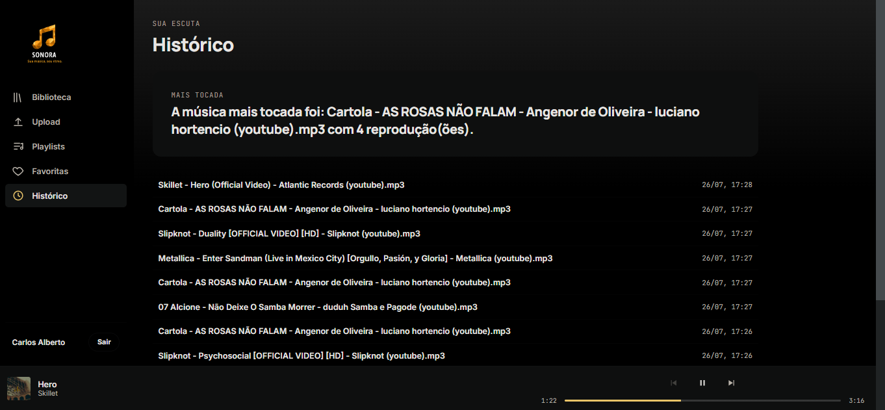

<div align="center">


# Sonora

**Sua música, seu ritmo.**

Uma plataforma de streaming de música full-stack, com API REST em Spring Boot e front-end em React — autenticação com JWT, upload e streaming de arquivos MP3, playlists, favoritas e histórico de reprodução.


</div>

---

## Índice

- [Sobre o projeto](#sobre-o-projeto)
- [Funcionalidades](#funcionalidades)
- [Stack técnica](#stack-técnica)
- [Arquitetura e estrutura de pastas](#arquitetura-e-estrutura-de-pastas)
- [Pré-requisitos](#pré-requisitos)
- [Como rodar](#como-rodar)
  - [Backend](#1-backend-api)
  - [Frontend](#2-frontend)
- [Referência da API](#referência-da-api)
- [Padrão de erros](#padrão-de-erros)
- [Segurança](#segurança)
- [Limitações conhecidas e próximos passos](#limitações-conhecidas-e-próximos-passos)
- [Autor](#autor)

---

## Sobre o projeto

Sonora é um projeto pessoal de estudo que simula uma plataforma de streaming de música (no estilo Spotify), construído para praticar autenticação stateless com JWT, modelagem de uma API REST completa e integração de um front-end React consumindo essa API do zero.

O projeto é dividido em duas partes independentes:

| Parte | Descrição |
|---|---|
| **`backend/`** | API REST em Spring Boot — autenticação, upload/streaming de músicas, playlists, favoritas e histórico. |
| **`frontend/`** | Aplicação React (Vite) que consome a API — biblioteca, player, playlists, favoritas e histórico. |

---

## Funcionalidades

### Conta e autenticação
- Cadastro com nome, e-mail e senha (validação de formato de e-mail e tamanho mínimo de senha)
- Login com geração de token JWT
- Rotas protegidas por Bearer token, com respostas padronizadas para token ausente, inválido ou expirado

### Biblioteca de músicas
- Upload de arquivos **MP3** (com validação de extensão e tipo de arquivo), com título, artista e gênero
- Listagem geral, busca por gênero e por artista
- Streaming (play) e download autenticados
- Exclusão de faixas

### Playlists
- Criar, renomear, excluir
- Adicionar e remover músicas
- Buscar por id ou por nome

### Favoritas
- Favoritar/desfavoritar uma música
- Listar todas as favoritas

### Histórico
- Registro automático de reprodução
- Consulta do histórico e da música mais tocada

### Front-end
- Login e cadastro com identidade visual própria
- Biblioteca com busca, player persistente (play/pause, avançar/voltar faixa, barra de progresso arrastável)
- Fila de reprodução: tocar uma lista inteira (biblioteca, playlist ou favoritas) habilita navegar entre as faixas dela
- Upload de MP3 com drag-and-drop
- Telas de Playlists (com detalhe, adicionar/remover faixas), Favoritas e Histórico
- Capas de música/playlist geradas automaticamente

---

# 📸 Interface da Aplicação

## 🔐 Login



---

## 🏠 Página Inicial



---

## 🎵 Playlists



---

## ❤️ Favoritas



---

## ⬆️ Upload de Músicas



---

## 📜 Histórico de Reproduções


  
## Stack técnica

**Backend**
- Java + Spring Boot (Spring Web, Spring Data JPA, Spring Security)
- Autenticação stateless com JWT ([jjwt](https://github.com/jwtk/jjwt))
- MySQL
- Bean Validation (`jakarta.validation`) para regras de entrada
- Tratamento de exceções centralizado (`@RestControllerAdvice`)

**Frontend**
- React 18 + Vite
- React Router
- CSS puro (sem framework de UI), com tokens de design (cores, tipografia) centralizados
- `fetch` nativo para consumo da API, sem bibliotecas externas de HTTP

---

## Arquitetura e estrutura de pastas

### Backend

```
backend/src/main/java/br/com/.../spring_boot_essentials/
├── config/           # Segurança, JWT, CORS
│   ├── SecurityConfigurations.java
│   ├── SecurityFilter.java
│   ├── TokenService.java
│   ├── CustomAuthenticationEntryPoint.java
│   └── CorsConfig.java
├── controller/        # Endpoints REST
├── dto/                # Objetos de entrada/saída da API
├── exception/          # Exceções de negócio + formato de erro
├── handler/            # Tratamento centralizado de exceções
├── model/              # Entidades JPA
├── repository/         # Repositórios Spring Data
└── service/            # Regras de negócio
```

### Frontend

```
frontend/src/
├── api/
│   └── client.js        # fetch central: token, tratamento de erro, download/stream autenticados
├── context/
│   ├── AuthContext.jsx   # sessão/token
│   └── PlayerContext.jsx # player de áudio e fila de reprodução
├── components/          # Sidebar, PlayerBar, TrackRow, ícones, etc.
├── pages/                # Login, Cadastro, Biblioteca, Upload, Playlists, Favoritas, Histórico
└── utils/                # helpers (capas, normalização de dados da API)
```

---

## Pré-requisitos

- **Java 17+** e **Maven** (ou a IDE de sua preferência com suporte a Maven)
- **MySQL** rodando localmente
- **Node.js 18+** e **npm**

---

## Como rodar

### 1. Backend (API)

1. Crie/garanta que existe uma instância MySQL local acessível (usuário/senha configurados em `application.yaml`). Por padrão, o banco `spring_usuarios` é criado automaticamente na primeira execução.

2. Ajuste, se necessário, `src/main/resources/application.yaml`:

   ```yaml
   spring:
     datasource:
       url: jdbc:mysql://localhost:3306/spring_usuarios?createDatabaseIfNotExist=true
       username: root
       password: ""
   server:
     port: 8082
   ```

3. Rode a aplicação (via IDE ou Maven):

   ```bash
   ./mvnw spring-boot:run
   ```

   A API sobe em `http://localhost:8082`.

### 2. Frontend

1. Instale as dependências e suba o servidor de desenvolvimento:

   ```bash
   cd frontend
   npm install
   npm run dev
   ```

2. Acesse `http://localhost:5173`.

3. Se a API não estiver em `http://localhost:8082`, crie um arquivo `.env` (baseado em `.env.example`) com:

   ```
   VITE_API_URL=http://localhost:SUA_PORTA
   ```

> **CORS:** o backend já vem configurado para aceitar requisições de `http://localhost:5173` (ver `CorsConfig.java`). Se o front rodar em outra origem/porta, ajuste essa configuração.

---

## Referência da API

Todas as rotas abaixo, exceto `/auth/login` e `/auth/register`, exigem o header:

```
Authorization: Bearer <token>
```

### Autenticação

| Método | Rota | Corpo | Descrição |
|---|---|---|---|
| `POST` | `/auth/register` | `{ "nome", "email", "senha" }` | Cria uma conta (201) |
| `POST` | `/auth/login` | `{ "email", "senha" }` | Autentica e retorna `{ "token" }` |

### Músicas

| Método | Rota | Descrição |
|---|---|---|
| `POST` | `/v1/midia/upload` | Upload de MP3 (multipart: `file` + `musica` como JSON) |
| `GET` | `/v1/midia/all` | Lista todas as músicas |
| `GET` | `/v1/midia/{id}` | Busca por id |
| `GET` | `/v1/midia/musicas/genero/{genero}` | Busca por gênero |
| `GET` | `/v1/midia/musicas/artista/{artista}` | Busca por artista |
| `GET` | `/v1/midia/play/{nomeArquivo}` | Streaming da música |
| `GET` | `/v1/midia/download/{nomeArquivo}` | Download do arquivo |
| `DELETE` | `/v1/midia/musicas/{id}` | Remove uma música |

### Playlists

| Método | Rota | Descrição |
|---|---|---|
| `POST` | `/v1/midia/playlists` | Cria playlist |
| `GET` | `/v1/midia/playlists/all` | Lista todas |
| `GET` | `/v1/midia/playlists/id/{id}` | Busca por id |
| `GET` | `/v1/midia/playlists/nome/{nome}` | Busca por nome |
| `POST` | `/v1/midia/playlists/{idPlaylist}/musicas/{idMusica}` | Adiciona música |
| `DELETE` | `/v1/midia/playlists/{idPlaylist}/musicas/{idMidia}` | Remove música |
| `PATCH` | `/v1/midia/playlists/novonome/{id}/{novoNome}` | Renomeia |
| `DELETE` | `/v1/midia/playlists/{idPlaylist}` | Exclui playlist |

### Favoritas

| Método | Rota | Descrição |
|---|---|---|
| `POST` | `/v1/midia/favoritar/{idMidia}` | Favorita |
| `DELETE` | `/v1/midia/favoritas/remove/{idMidia}` | Desfavorita |
| `GET` | `/v1/midia/favoritas/all` | Lista favoritas |
| `GET` | `/v1/midia/favoritas/{idMidia}` | Busca por id |
| `GET` | `/v1/midia/favoritas/nome/{titulo}` | Busca por título |

### Histórico

| Método | Rota | Descrição |
|---|---|---|
| `GET` | `/v1/midia/historico` | Lista o histórico de reprodução |
| `GET` | `/v1/midia/historico/maistocadas` | Retorna a música mais tocada |

---

## Padrão de erros

Todas as respostas de erro seguem o mesmo formato:

```json
{
  "timestamp": "2026-07-26T10:00:00",
  "status": 400,
  "erro": "Email inválido."
}
```

| Situação | Status |
|---|---|
| Campo obrigatório ausente / formato inválido (e-mail, senha curta, título vazio, arquivo que não é MP3) | `400 Bad Request` |
| Token ausente, inválido ou expirado | `401 Unauthorized` |
| Credenciais incorretas no login | `401 Unauthorized` |
| Recurso não encontrado | `404 Not Found` |
| E-mail já cadastrado | `409 Conflict` |

---

## Segurança

- Senhas armazenadas com **BCrypt**
- Autenticação **stateless** via JWT (sem sessão no servidor)
- Mensagens de erro de login não revelam se o e-mail existe ou não (proteção contra enumeração de usuários)
- Upload restrito a arquivos `.mp3` (validação de extensão e `Content-Type`)

---

## Limitações conhecidas e próximos passos

Documentando com transparência o estado atual do projeto:

- **Cobertura de testes**: ainda não há testes automatizados (unitários ou de integração) — próximo passo natural para elevar a maturidade do projeto.
- **DTOs de Playlist/Favoritas**: `PlayListDto` e `FavoritasDto` expõem a entidade JPA (`MidiaEntity`) diretamente em vez de um DTO dedicado, e têm alguns campos redundantes/não utilizados — candidatos a uma limpeza futura.
- **Sem paginação**: endpoints de listagem (`/all`) retornam a lista completa; para uma base maior de dados, valeria adicionar paginação.
- **Sem refresh token**: o JWT expira em 2h e exige novo login; não há mecanismo de renovação automática.
- **Armazenamento de arquivos**: os MP3s são salvos em disco local (pasta `uploads/`), não em um serviço de armazenamento externo (S3 ou similar).

---

## Autor

Desenvolvido por **Bruno da Silva Chagas** como projeto de estudo em Java/Spring Boot e React.
